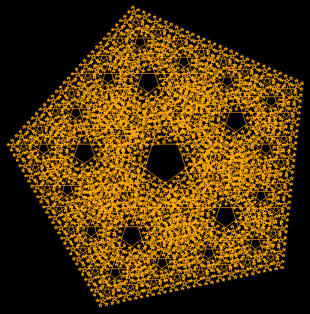
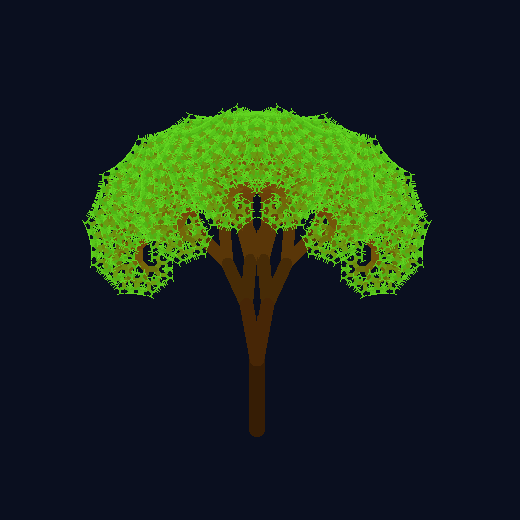
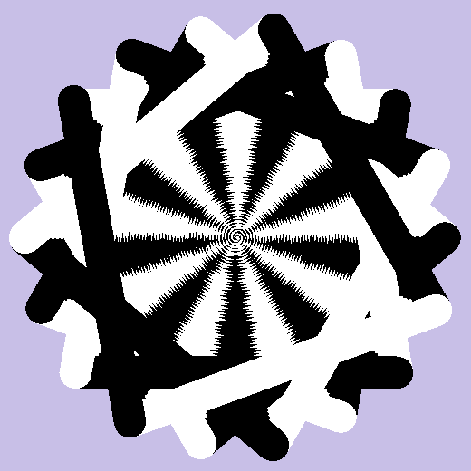
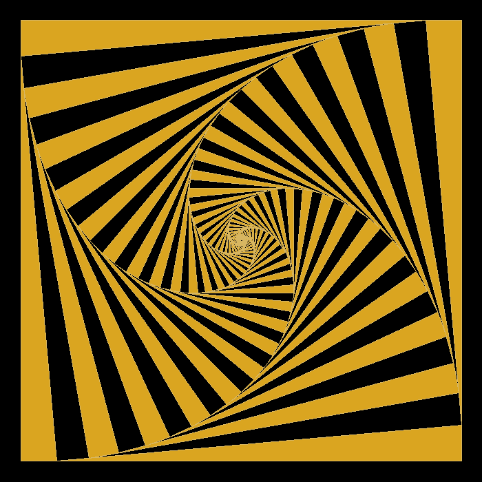

<h1 align="center">
    
</h1>
<p align="center">
    
    
    
    <a href="https://github.com/NyctibiusVII/Fractals/blob/main/LICENSE">
        
    </a>
</p>
<p align="center">
    <a href="#fractals-">Projeto</a>&nbsp;&nbsp;&nbsp;|&nbsp;&nbsp;&nbsp;
    <a href="#tecnologias-">Tecnologias</a>&nbsp;&nbsp;&nbsp;|&nbsp;&nbsp;&nbsp;
    <a href="#layout-">Layout</a>&nbsp;&nbsp;&nbsp;|&nbsp;&nbsp;&nbsp;
    <a href="#licença-%EF%B8%8F">Licença</a>
</p>

# Fractals 
Este repositório contém projetos para desenhar fractais usando a biblioteca Turtle em Python. Os fractais são imagens complexas e repetitivas que podem ser geradas a partir de um conjunto de regras simples. O projeto oferece uma variedade de fractais para explorar, além de exibir as imagens resultantes. Experimente e crie suas próprias obras de arte fractais!

#### Funcionalidades
* Diversidade de fractais
* Imagens de resultado
* Tratamento de erros

## Tecnologias 🚀
Esse projeto foi desenvolvido com as seguintes tecnologias:
- [Python](https://www.python.org)
- [Turtle](https://docs.python.org/3/library/turtle.html)

## Layout 🚧
### Draw Fractal
<div style="display: flex; flex-direction: 'column'; align-items: 'center';">
<!-- 700 x 700 -->
    
    
    
    
</div>

## Rodando o projeto 🚴🏻‍♂️
```bash
# Clone o repositório
$ git clone https://github.com/NyctibiusVII/Fractals.git

# Acesse a pasta do projeto no terminal
$ cd Fractals

# Entre na pasta do sub-projeto
$ cd tree

# Execute o projeto
$ python tree_fractal.py
```

## Contribuição 💭
Confira a página de [contribuição](./CONTRIBUTING) para ver como começar uma discussão e começar a contribuir.

## Licença ⚖️
Este projeto está sob a licença do MIT. Veja o arquivo [LICENSE](https://github.com/NyctibiusVII/Fractals/blob/main/LICENSE) para mais detalhes.

## Contribuidores 🦸🏻‍♂️
<a href="https://github.com/NyctibiusVII/Fractals/graphs/contributors">
    
</a>

<br/>
<br/>

###### Feito com ❤️ por Matheus Vidigal 👋🏻 [Entre em contato!](https://www.linkedin.com/in/matheus-vidigal-nyctibiusvii)